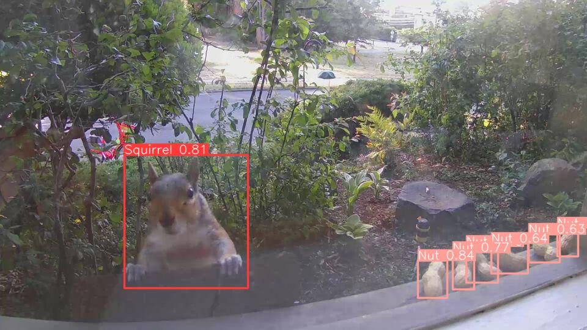

A collection of small datasets and pretrained models that you can use with PyLabel or any way you want to.

## Squirrels and Nuts
The squirrels and nuts dataset contains images of squirrels coming to a window to feed on nuts in Seattle, Washington.  The images were captured using the [Shinobi](https://shinobi.video/) open source CCTV solution. Then the frames were extracted and labelled using [AWS SageMaker Ground Truth](https://aws.amazon.com/sagemaker/data-labeling/). 

- [squirrelsandnuts_train.zip](squirrelsandnuts/squirrelsandnuts_train.zip) 100 images with Yolov5 annotations.
- [squirrelsandnuts_yolov5.pt](squirrelsandnuts/squirrelsandnuts_yolov5.pt) is a YOLOv5 model trained on the squirrelsandnuts dataset for 100 epochs with a mAP@.5 of 0.95.  You can use these commands to download and use the model. 
```
!wget https://github.com/pylabel-project/datasets_models/blob/main/squirrelsandnuts/squirrelsandnuts.pt?raw=true -O squirrelsandnuts.pt

model = torch.hub.load('ultralytics/yolov5', 'custom', path='squirrelsandnuts.pt', force_reload=True) 
```

## BCCD Dataset
BCCD Dataset is a small-scale dataset for blood cells detection. The official repo for this dataset is here https://github.com/Shenggan/BCCD_Dataset.
-  [BCCD_coco.zip](BCCD/BCCD_coco.zip) is a copy of the full dataset with annotations in COCO format. The orginal dataset uses VOC format.
- [BCCD_yolov5.pt](BCCD/BCCD_yolov5.pt) is a YOLOv5 model trained on the BCCD dataset for 20 epochs with a mAP@.5 of 0.91.  You can use these commands to download and use the model. 

```
!wget https://github.com/pylabel-project/datasets_models/blob/main/BCCD/BCCD_yolov5.pt?raw=true -O BCCD_yolov5.pt

model = torch.hub.load('ultralytics/yolov5', 'custom', path='BCCD_yolov5.pt', force_reload=True) 
```


